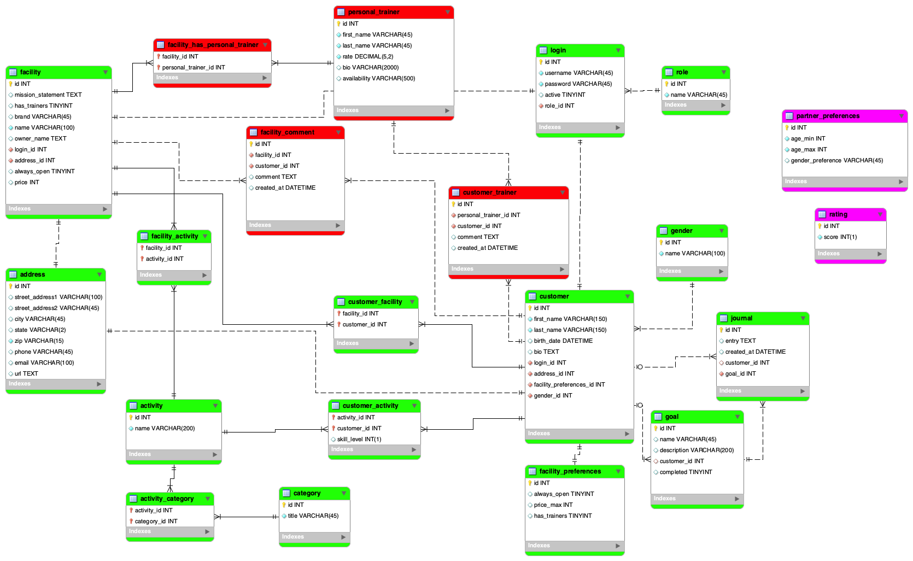

# Spotr - A Local Fitness Finder

## Developers
#### [Kate Remick](https://github.com/Kate-Remick), [Matt Elmore](https://github.com/dawabar), [Max Goduco](https://github.com/mgoduco), [Nick Gonzalez](https://github.com/gonzanick)

## Overview

Spotr is intended to be used by a customer to find different fitness facilities based on their location, desired activity, and general category of exercise. Facility owners are also able to utilize the application to advertise and have customers view and potentially join their gym or facility.

## Description

This full-stack web application utilizes a fully developed MySQL database schema connected to Java through JPA. Following C.R.U.D the app allows the manipulation of different entities in the database tables. Two different types of users with different permissions can log in and are authenticated through a MySQL table. The customer user has a log and can track different goals and journal entries with timestamps to track their fitness progress.

## Lessons Learned
- **Utilize git branches and merge consistently to main branch to optimize team production**
  - Our team spent a lot of time on a single Git branch, and a later merge to the main branch proved challenging.
  - More frequent merges would have helped with this challenge as well.
- **Emphasize simplicity in database schema design**
  - Creating a schema table with a compound key caused more problems than it solved.
  - In one instance, our team used five separate JOIN statements in a single SQL query to connect all relevant information for a customer entity.
  - At the same time, sometimes database complexity is necessary to achieve complex tasks in information management.
- **Learning the rules of the technology comes with time and experience**
  - Java beans using Spring boot cannot pass objects to Controllers. :(
  - Creating an elegant and unified front-end experience requires deep design from the beginning.
- **Using HTML and CSS to format and build a cleaner looking site**
  - The power of combining Bootstrap, flex boxes, JSTL, and traditional CSS3 to enhance HTML made the front-end experience more beautiful.
  - In contrast, the modern design paradigm of infinitely-nested DIV tags is challenging for new programmers to embrace multiple frameworks at once.
- **Achieving story points in a sprint is truly a team effort**
  - Team members played to their strengths to accomplish tasks rapidly.
  - Team members were always coaching each other to learn more about the technologies used.
  - Communication enabled the team to respond quickly and prevent issues.
  - Flexible expectations about how the project evolved, and team cohesion, kept the focus on collective success.

## Technologies Used
- Frontend
  - HTML/CSS
  - Bootstrap
  - Java Standard Tag Library (JSTL)
- Backend
  - Java
  - Spring MVC (Model-View-Control)
  - MySQL Workbench
  - MySQL
  - Gradle
  - Unix Terminal and shell commands
  - Java Persistence API (JPA)
  - Hibernate
- Collaboration
  - Git and Github
  - Zoom
  - Slack
- Research
  - Google
  - StackOverflow
  - Mozilla Developer Network
  - SD SQUAD

## Enhanced Entity Relationship (EER) Diagram

